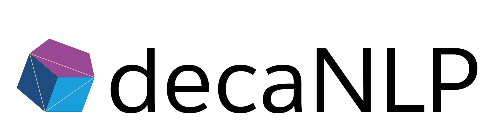

--------------------------------------------------------------------------------
[](https://travis-ci.org/salesforce/decaNLP)

The Natural Language Decathlon is a multitask challenge that spans ten tasks:
question answering, machine translation, summarization, natural language inference, sentiment analysis, semantic role labeling, zero-shot relation extraction, goal-oriented dialogue, semantic parsing, and commonsense pronoun resolution.
Each task is cast as question answering, which makes it possible to use our new Multitask Question Answering Network (MQAN).
This model jointly learns all tasks in decaNLP without any task-specific modules or parameters in the multitask setting. For a more thorough introduction to decaNLP, see our [blog post](https://einstein.ai/research/the-natural-language-decathlon) or [paper](https://arxiv.org/abs/1806.08730).

## Leaderboard

| Model | decaNLP | SQuAD | IWSLT | CNN/DM | MNLI | SST | QA&#8209;SRL | QA&#8209;ZRE | WOZ | WikiSQL | MWSC |
| --- | --- | --- | --- | --- | --- | --- | ---- | ---- | --- | --- |--- | 
| [MQAN](https://einstein.ai/static/images/pages/research/decaNLP/decaNLP.pdf) | 571.7 | 74.3 | 13.7 | 24.6 | 69.2 | 86.4 | 77.6 | 34.7 | 84.1 | 58.7 | 48.4 |
| [S2S](https://einstein.ai/static/images/pages/research/decaNLP/decaNLP.pdf) | 513.6 | 47.5 | 14.2 | 25.7 | 60.9 | 85.9 | 68.7 | 28.5 | 84.0 | 45.8 | 52.4 |

## Getting Started

First, make sure you have [docker](https://www.docker.com/get-docker) and [nvidia-docker](https://github.com/NVIDIA/nvidia-docker) installed. Then build the docker image:

```bash
cd dockerfiles && docker build -t decanlp . && cd -
```

You will also need to make a `.data` directory and move the examples for the Winograd Schemas into it:
```bash
mkdir .data/schema
mv local_data/schema.txt .data/schema/
```

You can run a command inside the docker image using 
```bash
nvidia-docker run -it --rm -v `pwd`:/decaNLP/ -u $(id -u):$(id -g) decanlp bash -c "COMMAND"
```

## Training

For example, to train a Multitask Question Answering Network (MQAN) on the Stanford Question Answering Dataset (SQuAD):
```bash
nvidia-docker run -it --rm -v `pwd`:/decaNLP/ -u $(id -u):$(id -g) decanlp bash -c "python /decaNLP/train.py --train_tasks squad --gpu DEVICE_ID"
```

To multitask with the fully joint, round-robin training described in the paper, you can add multiple tasks:
```bash
nvidia-docker run -it --rm -v `pwd`:/decaNLP/ -u $(id -u):$(id -g) decanlp bash -c "python /decaNLP/train.py --train_tasks squad iwslt.en.de --train_iterations 1 --gpu DEVICE_ID"
```

To train on the entire Natural Language Decathlon:
```bash
nvidia-docker run -it --rm -v `pwd`:/decaNLP/ -u $(id -u):$(id -g) decanlp bash -c "python /decaNLP/train.py --train_tasks squad iwslt.en.de cnn_dailymail multinli.in.out sst srl zre woz.en wikisql schema --train_iterations 1 --gpu DEVICE_ID"
```

You can find a list of commands in `experiments.sh` that correspond to each trained model that we used to report validation results comparing models and training strategies in the paper.

### Tensorboard

If you would like to make use of tensorboard, run (typically in a `tmux` pane or equivalent):

```bash
docker run -it --rm -p 0.0.0.0:6006:6006 -v `pwd`:/decaNLP/ decanlp bash -c "tensorboard --logdir /decaNLP/results"
```

If you are running the server on a remote machine, you can run the following on your local machine to forward to http://localhost:6006/:

```bash
ssh -4 -N -f -L 6006:127.0.0.1:6006 YOUR_REMOTE_IP
```

If you are having trouble with the specified port on either machine, run `lsof -if:6006` and kill the process if it is unnecessary. Otherwise, try changing the port numbers in the commands above. The first port number is the port the local machine tries to bind to, and and the second port is the one exposed by the remote machine (or docker container).

### Caveats During Training

- On a single NVIDIA Volta GPU, the code should take about 3 days to complete 500k iterations. These should be sufficient to approximately reproduce the experiments in the paper. 
- The model can be resumed using stored checkpoints using `--load <PATH_TO_CHECKPOINT>` and `--resume`. By default, models are stored every `--save_every` iterations in the `results/` folder tree. 
- During training, validation can be slow! Especially when computing ROUGE scores. Use the `--val_every` flag to change the frequency of validation. 
- If you run out of memory, reduce `--train_batch_tokens` and `--val_batch_size`.
- The first time you run, the code will download and cache all considered datasets. Please be advised that this might take a while, especially for some of the larger datasets. 


## Evaluation

You can evaluate a model for a specific task with `EVALUATION_TYPE` as `validation` or `test`:

```bash
nvidia-docker run -it --rm -v `pwd`:/decaNLP/ -u $(id -u):$(id -g) decanlp bash -c "python /decaNLP/predict.py --evaluate EVALUATION_TYPE --path PATH_TO_CHECKPOINT_DIRECTORY --gpu DEVICE_ID --tasks squad"
```

or evaluate on the entire decathlon by removing any task specification:
```bash
nvidia-docker run -it --rm -v `pwd`:/decaNLP/ -u $(id -u):$(id -g) decanlp bash -c "python /decaNLP/predict.py --evaluate EVALUATION_TYPE --path PATH_TO_CHECKPOINT_DIRECTORY --gpu DEVICE_ID"
```

For test performance, please use the original [SQuAD](https://rajpurkar.github.io/SQuAD-explorer/), [MultiNLI](https://www.nyu.edu/projects/bowman/multinli/), and [WikiSQL](https://github.com/salesforce/WikiSQL) evaluation systems.

## Citation

If you use this in your work, please cite [*The Natural Language Decathlon: Multitask Learning as Question Answering*](https://arxiv.org/abs/1806.08730).

```
@article{McCann2018decaNLP,
  title={The Natural Language Decathlon: Multitask Learning as Question Answering},
  author={Bryan McCann and Nitish Shirish Keskar and Caiming Xiong and Richard Socher},
  journal={arXiv preprint arXiv:1806.08730},
  year={2018}
}
```

## Contact

Contact: [bmccann@salesforce.com](mailto:bmccann@salesforce.com) and [nkeskar@salesforce.com](mailto:nkeskar@salesforce.com)
